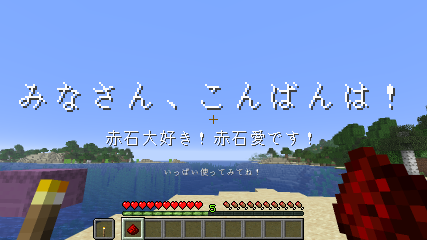

# ItemClicker

📄 [Read in English](./README_en.md)

アイテムをクリックして好きなコマンドを実行できるデータパックです。  


---

## 🎥 製作風景アーカイブ

> 製作の様子が見られます

[](https://www.youtube.com/watch?v=RycaJhRIKu0)
📺 [YouTubeで見る](https://www.youtube.com/watch?v=RycaJhRIKu0)  

---

## ✅ 対応バージョン

- **Snapshot 25w42a (Minecraft 1.21.11)**

---

## 📦 依存ライブラリ

ありません。

---

## 🧭 基本仕様

- 初期状態では、実行したプレイヤーの**利き手のアイテム**が対象になります。  
実行者がプレイヤーでないときは、**`contents`に相当するスロット**にあるアイテムが対象になります。
- **複数のコマンドを登録可能**です。
- コマンドは**登録された順番**に実行されます。
- コマンドが設定されたアイテムでは、**攻撃やブロック破壊は行えなくなります**。
- コマンドの先頭にある`/`は**無視**されます。

---

## 🪄 コマンドの登録・解除

### コマンドを登録する

1. `/function #clicker:register/left {command:'<ここに好きなコマンド>'}`を実行します。

```nim
function #clicker:register/left {command:'title @s title "Item Clicker !!!"'}
-> 登録したアイテムを持って左クリックすると、「Item Clicker !!!」というタイトルが表示されます。
```

---

### コマンドを解除する

1. `/function #clicker:unregister/left {command:'<ここに好きなコマンド>'}`を実行します。

```nim
function #clicker:unregister/left {command:'title @s title "Item Clicker !!!"'}
-> アイテムに「title @s title "Item Clicker !!!"」が登録されている場合、それが解除されます。
```

---

### コマンド登録・解除の対象を変更する

#### 初期状態に戻す

1. `/function #clicker:target/clear`を実行します。

#### 実行者の任意のスロットを対象にする

1. `/function #clicker:target/set_entity {slot:"<スロット名>"}`を実行します。

```nim
function #clicker:target/set_entity {slot:"saddle"}
-> 登録・解除の対象が、実行者のサドルスロットのアイテムになります。
```

#### 実行地点のブロックの任意のスロットを対象にする

1. `/function #clicker:target/set_block {slot:"<スロット名>"}`を実行します。

```nim
function #clicker:target/set_block {slot:"container.0"}
-> 登録・解除の対象が、実行地点のブロックのコンテナ内の最初のアイテムになります。
```

---

## 📮 連絡先

不具合報告や質問などはお気軽にどうぞ：

- [@AiAkaishi on Twitter（X）](https://twitter.com/AiAkaishi)

---

## 📄 ライセンス

このデータパックは **MITライセンス** のもとで公開されています。
