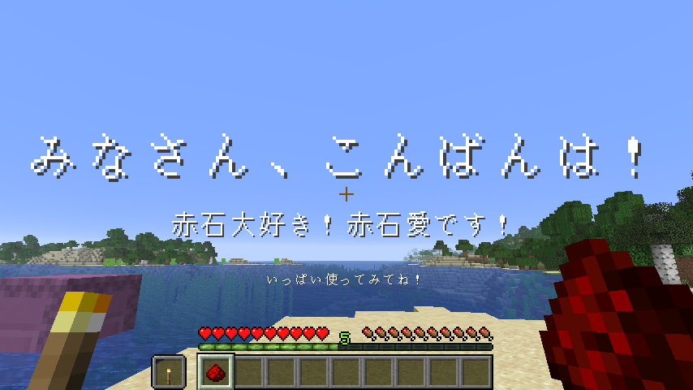

# ItemClicker

📄 [日本語で読む](./README.md)

A datapack that lets you execute any command by clicking an item.  


---

## 🎥 Development Stream Archive

> You can watch the making process

[](https://www.youtube.com/watch?v=RycaJhRIKu0)  
📺 [Watch on YouTube](https://www.youtube.com/watch?v=RycaJhRIKu0)  

---

## ✅ Supported Version

- **Snapshot 25w42a (Minecraft 1.21.11)**

---

## 📦 Dependencies

None.

---

## 🧭 Basic Features

- By default, the **item in the executing player’s main hand** is targeted.  
If the executor is not a player, the targeted item is the one **in the slot equivalent to `contents`**.
- **Multiple commands can be registered.**
- Commands are executed **in the order they were registered**.
- With commands registered, the item **cannot attack or break blocks**.
- A leading `/` in a command is **ignored**.

---

## 🪄 Registering / Unregistering Commands

### Register a command

1. Run `/function #clicker:register/left {command:'<your command here>'}`.

```nim
function #clicker:register/left {command:'title @s title "Item Clicker !!!"'}
-> When you left-click while holding the registered item, the title "Item Clicker !!!" will be displayed.
```

---

### Unregister a command

1. Run `/function #clicker:unregister/left {command:'<your command here>'}`.

```nim
function #clicker:unregister/left {command:'title @s title "Item Clicker !!!"'}
-> If the item has the command `title @s title "Item Clicker !!!"` registered, it will be removed.
```

---

### Change the target for registering/unregistering

#### Reset to default

1. Run `/function #clicker:target/clear`.

#### Use any slot of the executor

1. Run `/function #clicker:target/set_entity {slot:"<slot name>"}`.

```nim
function #clicker:target/set_entity {slot:"saddle"}
-> The target for register/unregister becomes the item in the executor’s saddle slot.
```

#### Use any slot of the block at the execution position

1. Run `/function #clicker:target/set_block {slot:"<slot name>"}`.

```nim
function #clicker:target/set_block {slot:"container.0"}
-> The target for register/unregister becomes the first item in the container of the block at the execution position.
```

---

## 📮 Contact

For bug reports or questions:

- [@AiAkaishi on X (Twitter)](https://twitter.com/AiAkaishi)

---

## 📄 License

This datapack is released under the **MIT License**.
